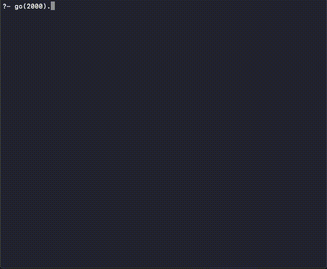

# Mini-projet Programmation Logique par Contraintes

Le but de ce mini-projet est de coder un algorithme génétique pour résoudre un problème de plus court chemin pour un voyageur de commerce.
Le graph associé est représenté par une matrice dont les valeurs aux positions `(i,j)` représentent le cout pour aller à ce sommet du graph.
Plusieurs paramètres sont disponibles dans le programme, différentes matrices sont données avec une solution optimale possible pour chacune.

## Fonctions implémentées
Mutation :
 - adjacence
 - échange

Sélection remplacement :
 - élitisme (ou déterministe)
 - *tournois*

Sélection reproduction :
 - élitisme (ou déterministe)
 - *tournois*

Croisement :
 - uniforme

Génération de population :
 - aléatoire sur intervalle auto-réducteur

## Tailles de matrices disponibles et solutions optimales :
|Taille|Cout|Parcours associé|
|:---:|:---:|:---:|
|4|70|[1,4,3,2]|
|5|20|[1,3,4,5,2]|
|6|19|[1,3,4,2,5,6]|
|7|2276|[1,2,4,6,3,5,7]|
|16|6859|[1,14,13,12,7,6,15,5,11,9,10,16,3,2,4,8,1]|
|29|2020|[1,28,6,12,9,5,26,29,3,2,20,10,4,15,18,17,14,22,11,19,25,7,23,27,8,24,16,13,21]|

## Lancement
### Prérequis
Pour executer l'algorithme, le logiciel [SWI-Prolog](https://www.swi-prolog.org/) est requis. Sont installation est simple et expliquée sur le site officiel. La version en ligne, swish, n'est pas compatible.
### Execution
Une fois [SWI-Prolog](https://www.swi-prolog.org/) installé, il suffit de rentrer les paramètres voulus dans les parédicats `param/2` du fichier `main.pl`, puis d'appeler le prédicat `go()/1` dans la console pour lancer l'execution avec en paramètre le nombre d'iterations que l'on souhaite réaliser.

### Exemple d'execution

